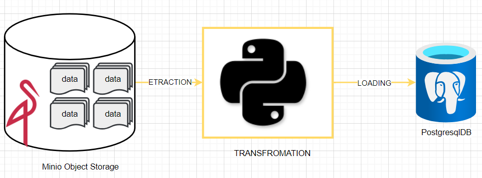

## ETL - TESTING -PROCESS

### ENGLISH VERSION
-----------------------------------------------------------------------------------------------------------------------------------------
### FRENCH VERSION
Le testing de solution est une etape tres importante dans la conception de solution technologique; l'objectif etant de concevoir des solutions toujours plus robustes. De plus dans le contexte de mise en place des pipelines de données, des exigences de performance sont a prendre en compte. C'est donc suivant ces exigences qu'une panoplie de test sera realiser.

#### Contexte historique
Dans le contexte de ce projet, les données au format parquet sont prealablement stockées dans un bucket minio.

- Etape (1) : Extraction des données brutes depuis le bucket minio  

- Etape (2) : Transformation des données extraites suivant un data modeling bien elaborées. 
Pour le modeling je me suis fortement inspiré du data modeling realisé par un mentor et senior data engineer : <a href = "https://github.com/darshilparmar">darshil parmar</a>.
Suivant ce modeling, les scripts de transformation des données ont été realisé pour l'alimatentation de notre base de données postgresql.

- Etape (3) : Loading des données dans base de données realitionnels Postgresql 
Il s'agit de l'etape de stockage des données transformnées  dans un systeme  de stockages realationnels 
et mise aux bons format avant leurs utilisations pour besoins de l'analytics.

- Etape (4) : Realisation des test unitaires des fonctions des differentes fonctions de l'ETL 
La liste des tests realisés seront  :  
    - (1) Etape Extraction:
        -> check des colonnes dans les dataframes
        -> check des dimensions
        -> check sur les types de données
        -> check comparaison sur les uniques de chaques colonnes.
        -> check sur l'alteration des données au transport 
         
    - (2) Etape transformation:
        ->  check des colonnes pour les differents dataframes de la table de fait et des differentes tables de dimension.
         
    - (3) Etape loading:
        -> check des colonnes charger en base de données 
        -> check des dimensions
        -> check sur les types de données
        -> check comparaison sur les uniques de chaques colonnes.
         

### Architecture

#### Tests
Dans le contexte de ce projet, nous avons realisé divers test notament :
- TESTS UNITAIRES
- TESTS D'INTEGRATION 

### TUTORIELS
(1) Lancer l'instance docker minio presente dans le fichier docker compose en tappant :
> *docker compose up* ou *docker-compose up* 
 

(2) Acceder à l'UI de minio créer un bucket  avec les credentials :
> user : minioadmin / password : minioadmin
> dans notre cas ce sera :  nyc-cab-data

(3) Une fois le bucket créer insérer manuellement le fichier tabulaires dans le bucket par drag and drop
*nb : Dans notre exemple le fichier associées à l'eperience est dans le repertoire data/data_for_bucket_minio*

(4) Dans le fichier shared/credentials_engine.py, verifié la configuration des credentials postgresql et minio

(5) Excécuté le main de l'application 

(6) Observé les logs dans le fichier logs.log pour un rapport complet de ceux qui à été realiser.

(7) On passe ensuite à l'etape des tests de notre pipeline de données 
- test unitaire 
- test d'integration 

## RESULTATS
- test unitaire : 
#### visuel : 

#### explications : 

- test performance
#### visuel : 

#### explications : 

## CONCLUSIONS