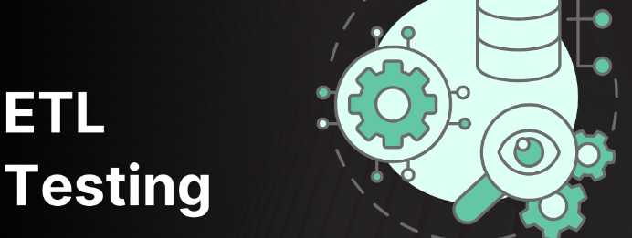
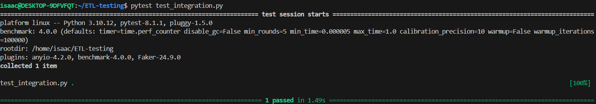
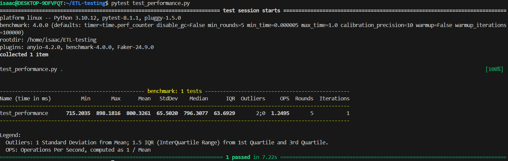
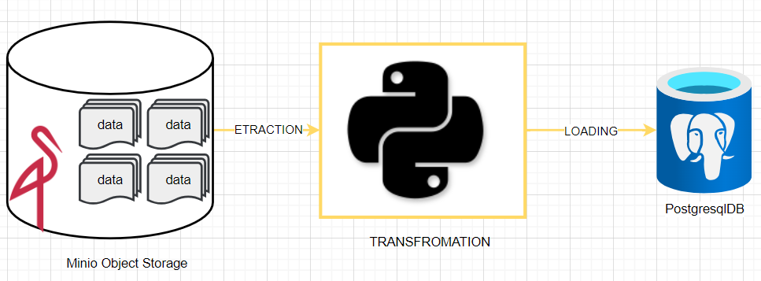
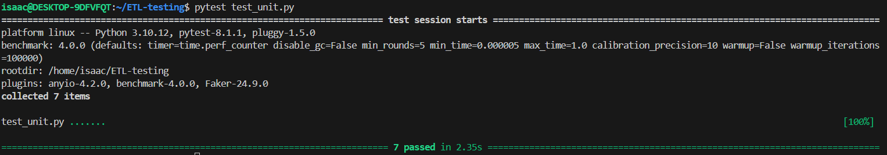

## ETL - TESTING -PROCESS

### ENGLISH VERSION
Testing solutions is a crucial step in technological solution design, aiming to create increasingly robust solutions. Especially in the context of setting up data pipelines, performance requirements must be taken into account. Thus, according to these requirements, a variety of tests will be conducted.

#### Historical Context
In the context of this project, data in parquet format is initially stored in a MinIO bucket.

- Step (1): Extraction of raw data from the MinIO bucket.
- Step (2): Transformation of extracted data following a well-elaborated data modeling.
For modeling, I heavily relied on the data modeling done by a mentor and senior data engineer: [Darshil Parmar](https://github.com/darshilparmar).
Following this modeling, data transformation scripts were created for feeding our PostgreSQL database.
- Step (3): Loading data into the PostgreSQL relational database.
This step involves storing transformed data in a relational storage system and formatting it correctly before using it for analytics purposes.

#### Tests
In the context of this project, various tests were conducted, including:
- UNIT TESTS
- INTEGRATION TESTS

### TUTORIALS
(1) Launch the MinIO Docker instance present in the docker-compose file by typing:

(2) Access the MinIO UI, create a bucket with the following credentials:
- URL: http://localhost:9001/
- User: minioadmin / Password: minioadmin
- Bucket: nyc-cab-data

(3) Once the bucket is created, manually insert the tabular file into the bucket by drag and drop.
(Note: In our example, the file associated with the experiment is in the data/data_for_bucket_minio directory)

(4) In the shared/credentials_engine.py file, verify the configuration of PostgreSQL and MinIO credentials.

(5) Execute the application's main.

(6) Observe the logs in the logs.log file for a complete report of what has been done.

(7) Then move on to the testing phase of our data pipeline:
- unit test
- integration test

## RESULTS
- Unit Test: Unit tests are essential to validate the business logic of each code component, detect errors early, and facilitate refactoring. Their automation ensures continuous quality assurance and guarantees code reliability as it evolves. By encouraging modular and documented design, unit tests also contribute to improving software quality and maintainability.
 

> command :  pytest test_unit.py 

 

#### visual : 

#### explanation : 
In the context of unit testing, tests are conducted on the various components of our solution. In an ETL, components are categorized into extraction, transformation, and loading scripts. The visual defines the report of unit tests that have been successfully conducted.

- Integration Test: Integration tests verify how different modules or components interact with each other in a complete system. They ensure that these interactions work correctly and that the components integrate coherently to achieve the system's objectives. By detecting integration issues early in the development process, these tests contribute to ensuring overall software robustness and stability.

 

> command :  pytest test_integration.py 

 

#### visual : 

#### explanation : 
In the context of our project, the integration test primarily aims to evaluate the data pipeline globally, which is conclusive. In other words, the proposed solution addresses the assigned objective from a global perspective and is reformulated in a formal language.

- Performance Test: Performance tests evaluate a system's ability to operate efficiently under different load conditions. They measure the speed, stability, and processing capacity of an application or system under variable loads, such as the number of users or data volume. By identifying bottlenecks and optimizing performance, these tests ensure a smooth and satisfactory user experience.

 

> command :  pytest test_performance.py 

 

#### visual : 

#### explanation : 
The processing time, which in the context of setting up a data pipeline equates to the time data is made available, is a metric to take into consideration. The primary goal of a data engineer is to make the right data available to business teams for decision-making in a timely manner. In the context of our project, the performance test mainly informs us of the processing time of our solution, which averages around 800 milliseconds for a flow executed 5 times. This is primarily the information that can be observed in the visual above.

## CONCLUSION

At the end of this experience, it is important to note that a data pipeline is a software solution like any other. Therefore, before any deployment, it is necessary to test the solution thoroughly to control all associated aspects and constraints. In my article entitled "[The Essential Features of a Quality Data Pipeline](https://medium.com/@nisaacemmanuel/les-atouts-indispensables-dun-datapipeline-de-qualit%C3%A9-291d63d82f29)", I discuss the importance of transparency to ensure that our data pipeline respects the assigned scope of execution. This work is the result of personal research, and I remain open to suggestions.

Take care and let's learn!

-----------------------------------------------------------------------------------------------------------------------------------------
### FRENCH VERSION
Le testing de solution est une etape tres importante dans la conception de solution technologique; l'objectif etant de concevoir des solutions toujours plus robustes. De plus dans le contexte de mise en place des pipelines de données, des exigences de performance sont a prendre en compte. C'est donc suivant ces exigences qu'une panoplie de test sera realiser.

#### Contexte historique
Dans le contexte de ce projet, les données au format parquet sont prealablement stockées dans un bucket minio.

- Etape (1) : Extraction des données brutes depuis le bucket minio  

- Etape (2) : Transformation des données extraites suivant un data modeling bien elaborées. 
Pour le modeling je me suis fortement inspiré du data modeling realisé par un mentor et senior data engineer : <a href = "https://github.com/darshilparmar">darshil parmar</a>.
Suivant ce modeling, les scripts de transformation des données ont été realisé pour l'alimatentation de notre base de données postgresql.

- Etape (3) : Loading des données dans base de données realitionnels Postgresql 
Il s'agit de l'etape de stockage des données transformnées  dans un systeme  de stockages realationnels 
et mise aux bons format avant leurs utilisations pour besoins de l'analytics.

- Etape (4) : Realisation des test unitaires des fonctions des differentes fonctions de l'ETL 
La liste des tests realisés seront  :  
    - (1) Etape Extraction:
        -> check des colonnes dans les dataframes
        -> check des dimensions
        -> check sur les types de données
        -> check comparaison sur les uniques de chaques colonnes.
        -> check sur l'alteration des données au transport 
         
    - (2) Etape transformation:
        ->  check des colonnes pour les differents dataframes de la table de fait et des differentes tables de dimension.
         
    - (3) Etape loading:
        -> check des colonnes charger en base de données 
        -> check des dimensions
        -> check sur les types de données
        -> check comparaison sur les uniques de chaques colonnes.
         

### Architecture

#### Tests
Dans le contexte de ce projet, nous avons realisé divers test notament :
- TESTS UNITAIRES
- TESTS D'INTEGRATION 

### TUTORIELS
(1) Lancer l'instance docker minio presente dans le fichier docker compose en tappant :
> *docker compose up* ou *docker-compose up* 
 

(2) Acceder à l'UI de minio créer un bucket  avec les credentials :
> on : http://localhost:9001/

> user : minioadmin / password : minioadmin

> Dans :  nyc-cab-data

(3) Une fois le bucket créer insérer manuellement le fichier tabulaires dans le bucket par drag and drop
*nb : Dans notre exemple le fichier associées à l'eperience est dans le repertoire data/data_for_bucket_minio*

(4) Dans le fichier shared/credentials_engine.py, verifié la configuration des credentials postgresql et minio

(5) Excécuté le main de l'application 

(6) Observé les logs dans le fichier logs.log pour un rapport complet de ceux qui à été realiser.

(7) On passe ensuite à l'etape des tests de notre pipeline de données 
- test unitaire 
- test d'integration 

## RESULTATS
- test unitaire : Les tests unitaires sont essentiels pour valider la logique métier de chaque composant du code, détecter précocement les erreurs et faciliter la refactorisation. Leur automatisation permet d'assurer une assurance qualité continue et de garantir la fiabilité du code au fur et à mesure de son évolution. En encourageant une conception modulaire et documentée, les tests unitaires contribuent également à améliorer la qualité et la maintenabilité du logiciel.
 

> command :  pytest test_unit.py 

 

#### visuel : 

#### explications : 
Dans le contexte du test unitaire, les tests sont realisées sur les differents composants de notre solution.
Dans un ETL, les composants sont categorisées en scripts d'extraction, de transformation et de loading.
Le visuel, definit le rapport des tests unitaires qui se sont realisées avec succès.

 

- test d'integration : Les tests d'intégration vérifient la manière dont les différents modules ou composants interagissent les uns avec les autres dans un système complet. Ils garantissent que ces interactions fonctionnent correctement et que les composants s'intègrent de manière cohérente pour atteindre les objectifs du système. En détectant les problèmes d'intégration dès le début du processus de développement, ces tests contribuent à assurer la robustesse et la stabilité globales du logiciel.
 

> command :  pytest test_intgration.py 

 

#### visuel : 

#### explications : 
Dans le contexte de notre projet, le test d'intégration vise principalement à évaluer globalement le pipeline de données, ce qui est concluant. En d'autres termes, la solution proposée résout l'objectif qui lui a été assigné d'un point de vue global et est reformulée dans un langage soutenu.
 

- test performance : Les tests de performance évaluent la capacité d'un système à fonctionner efficacement sous différentes conditions de charge. Ils mesurent la vitesse, la stabilité et la capacité de traitement d'une application ou d'un système sous des charges variables, telles que le nombre d'utilisateurs ou le volume de données. En identifiant les goulots d'étranglement et en optimisant les performances, ces tests garantissent une expérience utilisateur fluide et satisfaisante.

 

> command :  pytest test_performance.py 

 

#### visuel : 

#### explications : 
Le temps de processing qui dans le contexte de la mise en place d'un data pipeline s'assimile au temps de mise a dispostion des données est une metriques a prendre plus en compte, car l'objectif premier d'un data engineer est de mettre la bonne données a disposition des equipes metiers pour des prises de decisions dans les temps. Dans le contexte de notre projet, le test de performance vient principalement nous informer du temps de processing de notre solution qui s'estime a en moyenne 800 milliseconds pour un flow exécuté 5 fois. C'est principalement l'information qu'on peut observés dans le visuel ci-dessus.
 
 

## CONCLUSION

Au terme de cette expérience, retenons qu'un data pipeline est une solution logicielle comme toute autre. Par conséquent, il convient, avant tout déploiement, de tester la solution pour un contrôle complet de tous les aspects et contraintes associées. Dans mon article intitulé "<a href="https://medium.com/@nisaacemmanuel/les-atouts-indispensables-dun-datapipeline-de-qualit%C3%A9-291d63d82f29">Les atouts indispensables d'un Datapipeline de qualité</a>", je discute de l'importance de la transparence pour garantir que notre pipeline de données respecte bien le scope d'exécution qui lui a été assigné. Ce travail, ma foi, est le fruit de recherches personnelles, et je reste ouvert à toutes suggestions.

Take care and let's learn!